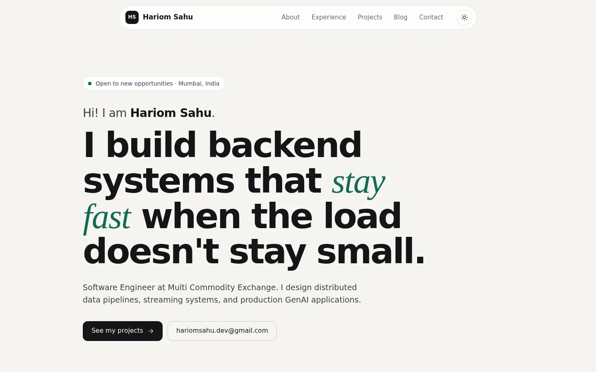
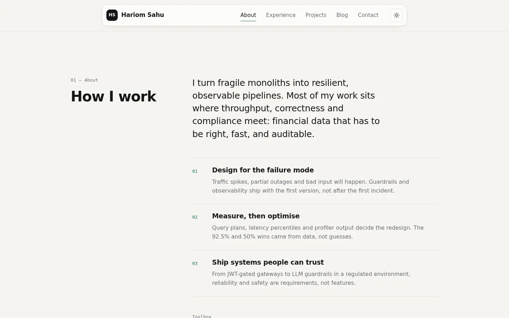
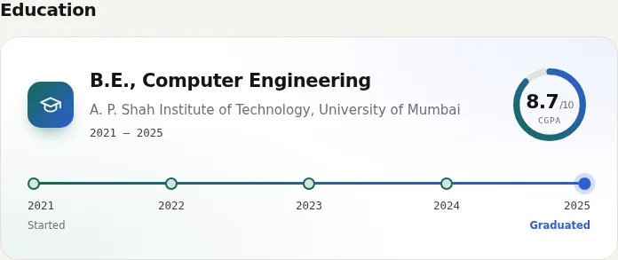
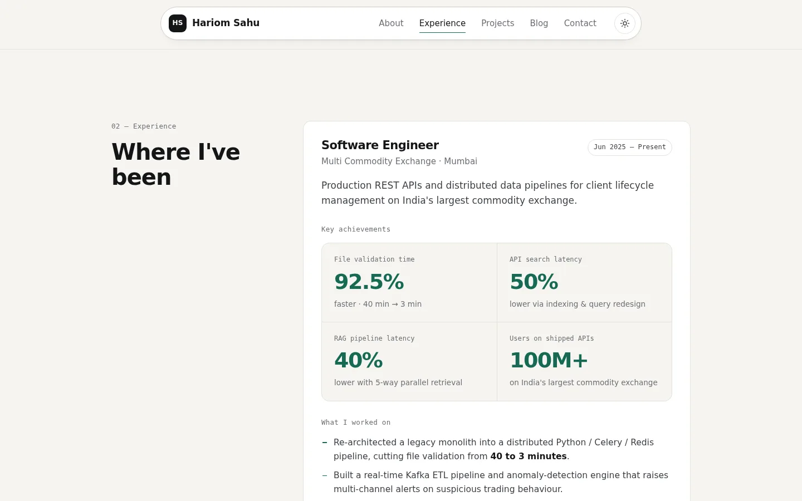
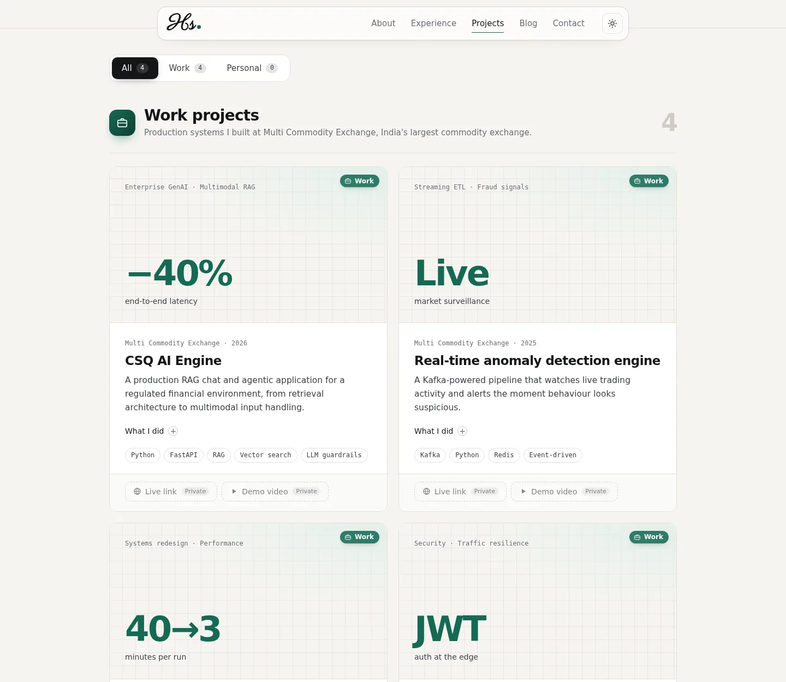
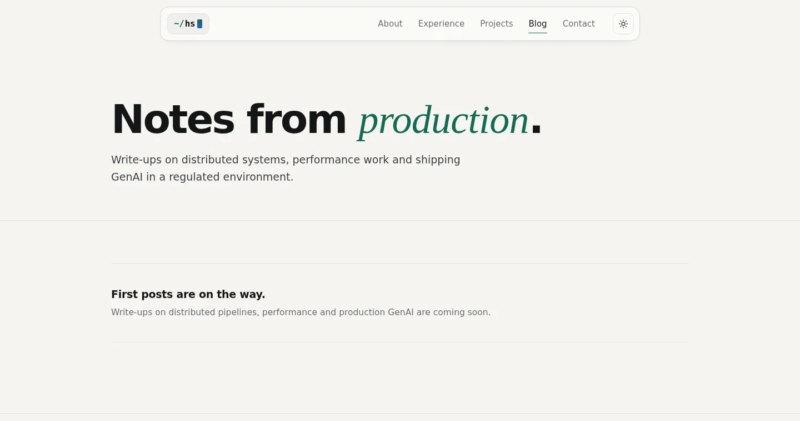
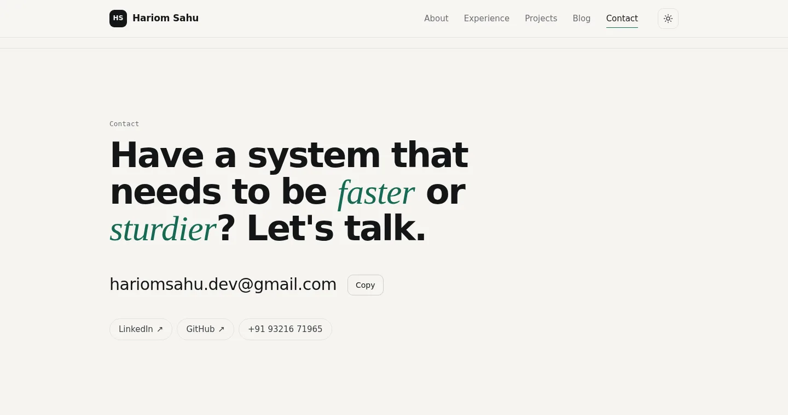
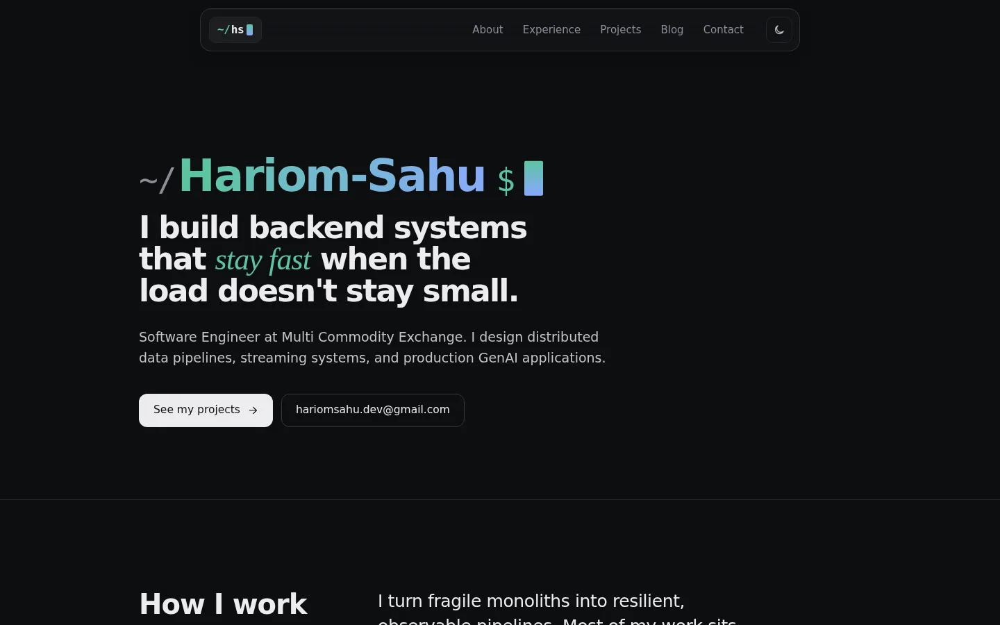
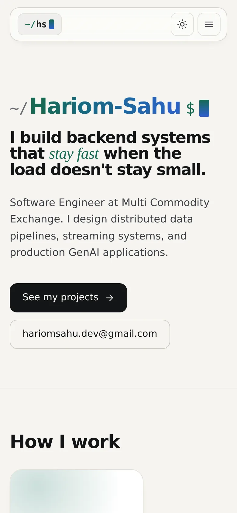

<div align="center">

# Hariom Sahu

**Software Engineer · Backend Systems & AI Applications**

Mumbai, India · Open to new opportunities

[**Visit the website →**](https://harry9321.github.io/New_Portfolio/)
&nbsp;·&nbsp; [Projects](https://harry9321.github.io/New_Portfolio/projects/)
&nbsp;·&nbsp; [Blog](https://harry9321.github.io/New_Portfolio/blog/)
&nbsp;·&nbsp; [LinkedIn](https://linkedin.com/in/hariom-dev)
&nbsp;·&nbsp; [Email](mailto:hariomsahu.dev@gmail.com)

</div>



This repository is my personal website. The README walks through the site page by page, so you can see everything here without opening it.

---

## Contents

1. [At a glance](#at-a-glance)
2. [Tour of the website](#tour-of-the-website)
   - [Home](#1-home)
   - [About](#2-about-how-i-work)
   - [Experience](#3-experience)
   - [Projects](#4-projects)
   - [Blog](#5-blog)
   - [Contact](#6-contact)
   - [Dark mode and mobile](#dark-mode-and-mobile)
3. [Projects in detail](#projects-in-detail)
4. [Skills](#skills)
5. [How this site is built](#how-this-site-is-built)

---

## At a glance

I design and ship high-throughput distributed systems and production GenAI applications at **Multi Commodity Exchange (MCX)**, India's largest commodity exchange, on a platform serving **100M+ users**.

| Result | What changed |
|---|---|
| **92.5% faster** file validation | 40 minutes → 3 minutes, by re-architecting a monolith into a Celery / Redis pipeline |
| **50% lower** API search latency | Query optimisation, schema redesign and B-Tree indexing |
| **40% lower** RAG pipeline latency | 5-way parallel retrieval with neural reranking |
| **100M+ users** | Served by the REST APIs I've shipped |

---

## Tour of the website

The site has three pages: **Home**, **Projects** and **Blog**. The header on every page links to all of them, and the sun/moon button switches between light and dark themes.

### 1. Home

[Open ↗](https://harry9321.github.io/New_Portfolio/)

The first screen opens with **"Hi! I am Hariom Sahu."** (hover over the name and the letters wave), says what I do in one line, shows my availability, and gives two actions: **See my projects** and email me. The menu bar floats centred at the top of every page, and on desktop your cursor throws off sparkling fire sparks that leave long, curving threads.

### 2. About: how I work

[Open ↗](https://harry9321.github.io/New_Portfolio/#about)



My photo sits beside a short intro that types itself out as you scroll in, followed by the three principles I build by:

1. **Design for the failure mode.** Traffic spikes, partial outages and bad input will happen, so guardrails and observability ship with the first version.
2. **Measure, then optimise.** Query plans, latency percentiles and profiler output decide the redesign.
3. **Ship systems people can trust.** Reliability and safety are requirements, from JWT-gated gateways to LLM guardrails.

Then an **Education** card: B.E., Computer Engineering at A. P. Shah Institute of Technology, University of Mumbai (2021 – 2025), with a timeline that draws itself from 2021 to 2025 and a ring that fills to a **CGPA of 8.7/10**.



It closes with my **toolbox**: each technology shown with its logo, grouped into Languages, Frameworks & libraries, Data & streaming, and Infrastructure. Tiles lift and glow in the tool's brand colour on hover.

### 3. Experience

[Open ↗](https://harry9321.github.io/New_Portfolio/#experience)



**Software Engineer, Multi Commodity Exchange** (Jun 2025 – Present)

Key achievements (shown as tiles that count up as you scroll): **92.5%** faster file validation · **50%** lower API search latency · **40%** lower RAG pipeline latency · **100M+** users on shipped APIs.

What I worked on:
- Re-architected a legacy monolith into a distributed Python / Celery / Redis pipeline: file validation went from **40 to 3 minutes**.
- Built a real-time **Kafka** ETL pipeline and anomaly-detection engine for suspicious trading behaviour.
- Halved API search latency through SQL optimisation, schema redesign and indexing.
- Designed a custom **Nginx API gateway** with JWT auth and rate limiting.
- Hardened UAT / pre-prod environments with Redis, reverse proxies and end-to-end observability.
- Built internal automation tools adopted company-wide.

### 4. Projects

[Open ↗](https://harry9321.github.io/New_Portfolio/projects/)



Projects are split into two groups, with **All / Work / Personal** tabs at the top:

- **Work projects**: production systems built at Multi Commodity Exchange.
- **Personal & solo projects**: things I build on my own, with live links and demo videos.

Every card has the same layout:
- **top:** a screenshot, video thumbnail or headline result, with a *Work* or *Personal* badge,
- **middle:** company or "Solo project", the year, a one-line summary, an expandable **What I did** list, and the tech used,
- **bottom:** **Live link** and **Demo video** buttons (the video plays in a pop-up player). Work systems that aren't public show these as *Private*.

Four featured projects also appear on the home page.

### 5. Blog

[Open ↗](https://harry9321.github.io/New_Portfolio/blog/)



Write-ups on distributed pipelines, performance work and shipping GenAI in production. Posts can be filtered by tag, and each post page shows the reading time, highlighted code, tables, images, embedded videos, and links to the next and previous posts. The three latest posts also appear on the home page.

### 6. Contact

[Open ↗](https://harry9321.github.io/New_Portfolio/#contact)



My email (with a one-click **Copy** button), then full-colour app-style tiles for **GitHub, LinkedIn, X (Twitter), phone and Gmail**. Hovering over a tile makes it lift, tilt and glow in its brand colour with a shine sweep, shows a label with the handle or number, and the tile pulls gently toward your cursor.

### Dark mode and mobile

| Dark mode | Mobile |
|---|---|
|  |  |

The site follows your system's light or dark setting, and the header toggle overrides it. On phones the navigation folds into a menu button.

---

## Projects in detail

| Project | What it is | Result | Stack |
|---|---|---|---|
| **CSQ AI Engine** | Production RAG chat and agentic app for a regulated financial environment | −40% end-to-end latency | Python, FastAPI, RAG, vector search, LLM guardrails |
| **Real-time anomaly detection engine** | Kafka pipeline that flags suspicious trading activity and sends multi-channel alerts | Live market surveillance | Kafka, Python, Redis |
| **Distributed file validation pipeline** | Sequential monolith rebuilt as a parallel task-queue system | 40 → 3 minutes per run | Celery, Redis, Python, PostgreSQL |
| **Custom Nginx API gateway** | Hardened edge layer with JWT auth and rate limiting | Downstream services protected from spikes | Nginx, JWT, AWS |

These are internal systems at MCX, so their code and demos aren't public. Details are available on request. New side projects with live demos and videos will be added to the [Projects page](https://harry9321.github.io/New_Portfolio/projects/).

---

## Skills

**Languages:** Python · Java · TypeScript · JavaScript
**Frameworks:** FastAPI · Node.js · React · SQLAlchemy · Celery
**Data:** PostgreSQL · MongoDB · Redis · Kafka
**Infrastructure:** Docker · AWS · Nginx · CI/CD
**AI:** RAG pipelines · vector search · neural reranking · LLM guardrails

---

## How this site is built

Plain **HTML, CSS and JavaScript**, with no framework and no build step. It's hosted for free on **GitHub Pages**.

- Content lives in two data files, `data/projects.js` and `data/posts.js`, and blog posts are Markdown files in `blog/posts/`.
- Light and dark themes, responsive down to small phones, keyboard-accessible, and all motion is turned off for visitors who prefer reduced motion.

**Run it locally**

```bash
git clone https://github.com/Harry9321/New_Portfolio.git
cd New_Portfolio
python -m http.server 8000     # then open http://localhost:8000
```

To add projects, blog posts or demo videos, or to deploy, see the **[maintainer guide](docs/CONTENT.md)**.

---

<div align="center">

**Let's talk:** [hariomsahu.dev@gmail.com](mailto:hariomsahu.dev@gmail.com) · [LinkedIn](https://linkedin.com/in/hariom-dev) · [GitHub](https://github.com/Harry9321)

</div>
