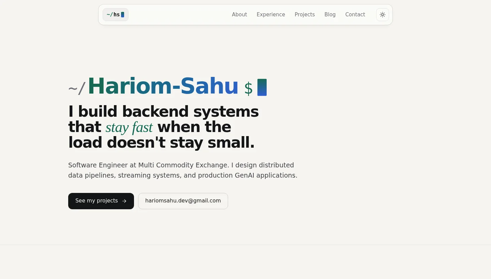

<div align="center">

# Hariom Sahu

**Software Engineer · Backend Systems & AI Applications**

[](https://hariom.is-a.dev)

</div>

Hey there 👋

This repo is the code behind my little corner of the internet: **[hariom.is-a.dev](https://hariom.is-a.dev)**.

[](https://hariom.is-a.dev)

## About me

I'm a backend engineer at **Multi Commodity Exchange (MCX)** in Mumbai. I build distributed data pipelines, real-time streaming systems and production GenAI apps, and spend most of my time making slow things fast and fragile things sturdy.

On the site you'll find my work, projects, a blog (warming up ✍️) and ways to reach me. I'd rather you explore it than read about it here, so [go take a look](https://hariom.is-a.dev). There are a few small surprises along the way 🔥

## Built with

- Plain **HTML, CSS and JavaScript**: no frameworks, no build step
- Hosted on **GitHub Pages**
- Domain courtesy of **[is-a.dev](https://is-a.dev)** 💚

## Run it locally

```bash
git clone https://github.com/Harry9321/New_Portfolio.git
cd New_Portfolio
python3 -m http.server 8000
```

Then open [localhost:8000](http://localhost:8000).

## Project structure

```
index.html          Home
projects/           Projects page
blog/               Blog + posts (Markdown)
data/               Projects & posts content
assets/             Styles, scripts, icons, images
docs/CONTENT.md     How to add projects, posts and videos
```

Adding a project or writing a post is a one-file edit. See **[docs/CONTENT.md](docs/CONTENT.md)**.

## Say hi

- 🌐 [hariom.is-a.dev](https://hariom.is-a.dev)
- 💼 [LinkedIn](https://linkedin.com/in/hariom-dev)
- 📧 [hariomsahu.dev@gmail.com](mailto:hariomsahu.dev@gmail.com)

Spotted a bug or have an idea? Feel free to [open an issue](https://github.com/Harry9321/New_Portfolio/issues).

---

<div align="center">
<sub>Made with ☕ in Mumbai</sub>
</div>
